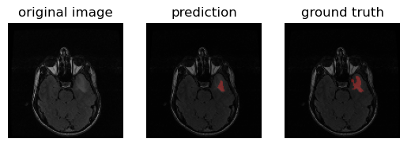
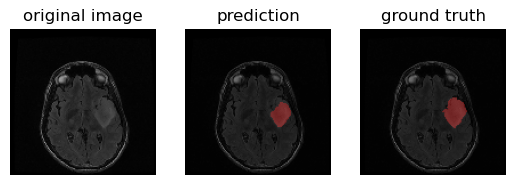
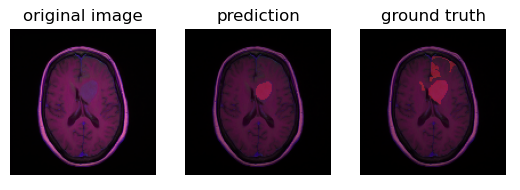
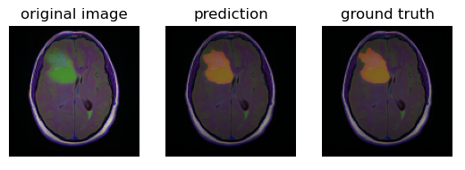

Brain tumor segmentation for the dataset used in article:

"Mateusz Buda, AshirbaniSaha, Maciej A. Mazurowski "Association of genomic subtypes of lower-grade gliomas with shape features automatically extracted by a deep learning algorithm." Computers in Biology and Medicine, 2019."

This dataset is a set of MRI sequences belonged to 110 patients who were on the The Cancer Genome Atlas (TCGA) lower-grade glioma collection. The format of the images had been converted to RGB channel by combining slices for 3 modalities.
To know more, check the original paper [here](https://arxiv.org/abs/1906.03720) 

Since the samples within this dataset are not plentiful, I've used the Unet model as the first choice to deal with tumor segmentation task with/without the support of state-of-art encoder

